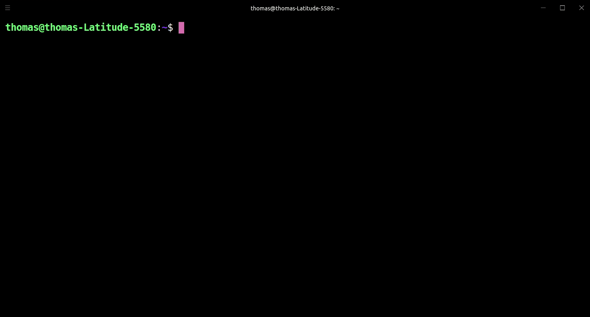

<h1 align="center">
  Passline
</h1>

<h4 align="center">
  Password manager for the command line
</h4>

<div align="center">
  
</div>

<div align="center">
   <a href="https://travis-ci.com/perryrh0dan/passline">
      
   </a>
   <a href="https://codecov.io/gh/perryrh0dan/passline">
      
   </a>
   <a href="https://codeclimate.com/github/perryrh0dan/passline/maintainability">
      
   </a>
   <a href="https://gitter.im/perryrh0danpassline/community">
      
   </a>
</div>

## Description

By utilizing a simple and minimal usage syntax, that requires a flat leaning curve, Passline enables you to effectively manage you password accross multiple devices within your terminal. All Password are stored AES-256 encrypted and can only be encrypted with a your global password. Currently data can be stored localy on your computer or in your own firebase database.

Visit the [contributing guidelines](https://github.com/perryrh0dan/passline/blob/master/contributing.md#translating-documentation) to learn more on how to translate this document into more languages.

## Highlights

- Multiple storage modules (local, firestore)
- Passwords and recovery codes are aes-256 encryped
- Intuitive and fast command line interface
- Filtering allows fast selection of credentials
- Build in update functionality

## Contents

- [Description](#description)
- [Highlights](#highlights)
- [Contents](#contents)
- [Install](#install)
- [Usage](#usage)
- [Flight Manual](#flight-manual)
- [Development](#development)

## Install

### Binary

1. Download the latest release for your platform
2. Run it

### Snapcraft

```bash
snap install passline
snap alias passline pl # set alias
```

**Note:** Due to the snap's strictly confined nature, both the storage & configuration files will be saved under the [ `$SNAP_USER_DATA` ](https://docs.snapcraft.io/reference/env) environment variable instead of the generic `$HOME` one.

## Usage

```
> passline --help
NAME:
   Passline - Password manager

USAGE:
   passline [global options] command [command options] [arguments...]

VERSION:
   0.5.3

DESCRIPTION:
   Password manager for the command line

COMMANDS:
   add, a       Add an existing password for a website
   backup, b    Create a backup
   generate, g  Generate a password for an item
   delete, d    Delete an item
   edit, e      Edit an item
   list, ls     List all items
   restore, r   Restore a backup
   update, u    Update to the newest release
   help, h      Shows a list of commands or help for one command

GLOBAL OPTIONS:
   --help, -h     show help
   --version, -v  print the version

WEBSITE:
   https://github.com/perryrh0dan/passline
```

### Flight Manual

#### Add

Add an existing username, password pair.

#### Backup

Create a backup. 

#### Generate

Generate a password for a website

#### Delete

Delete an existing username, password pair.

#### Edit

Edit an entry

#### List

List all websites

#### Restore

Restore a backup file.

#### Update

Update passline to the latest release on github.

## Development

### Linter

golangci-lint
VS-Code settings

```json
"go.lintTool":"golangci-lint",
"go.lintFlags": [
  "--fast"
]
```
